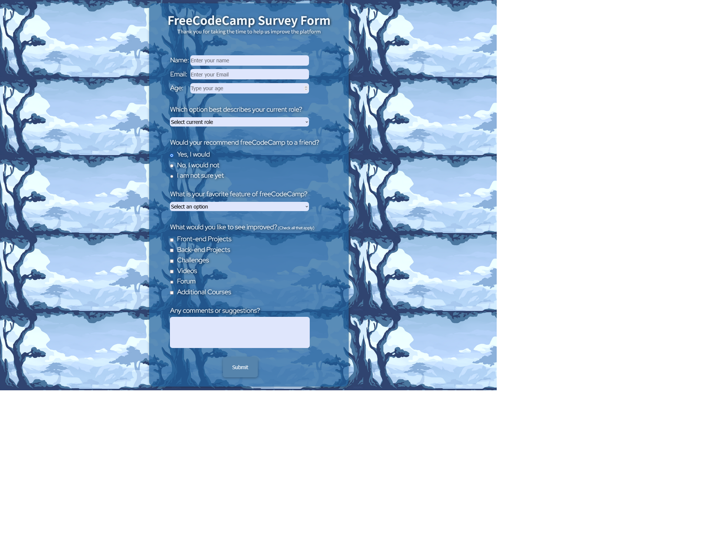

# Survey Form - FreeCodeCamp

 

 
 

This is a repository made to upload my result of the first required project of FreeCodeCamp Responsive Web Design course.

## Goal

This first certification project requires completion of 5 initial courses. The objective was to build a website similar to >https://survey-form.freecodecamp.rocks< utilizing the knowledge acquired in the first 4 modules (basic HTML and CSS), aiming to meet all the tests requirements.

 

Project's screenshot

 

  

 

